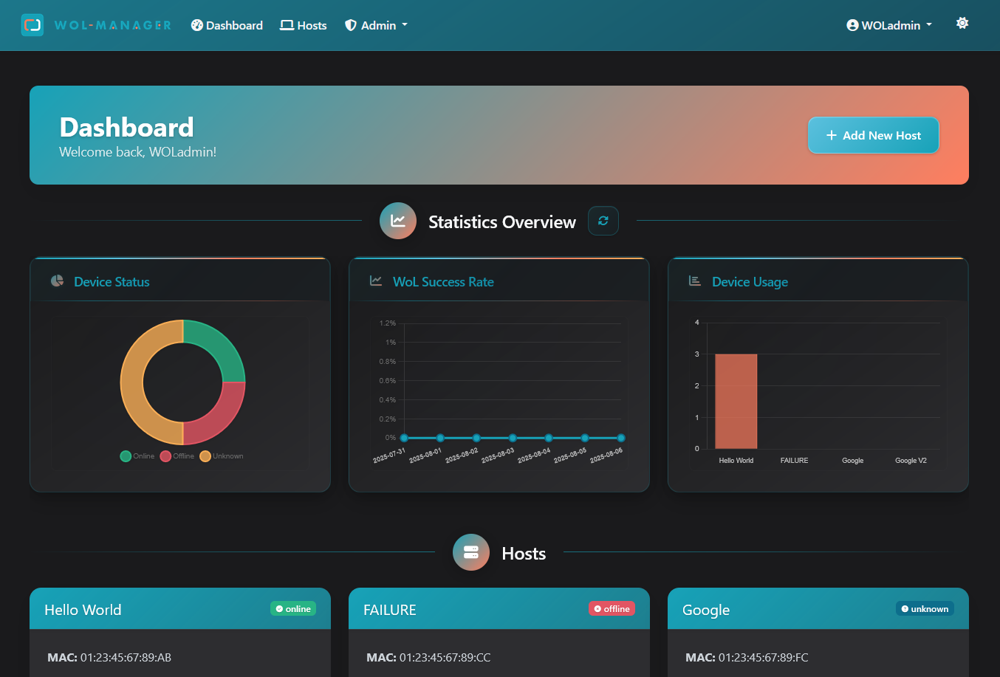
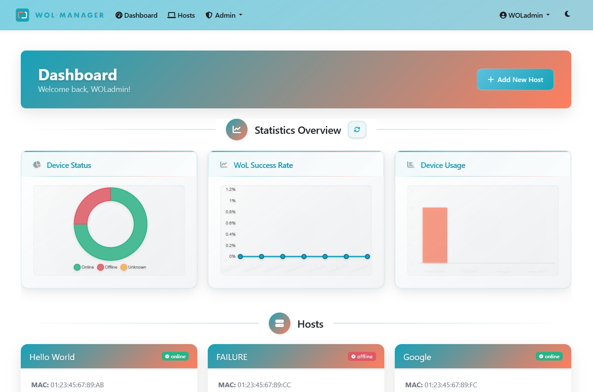
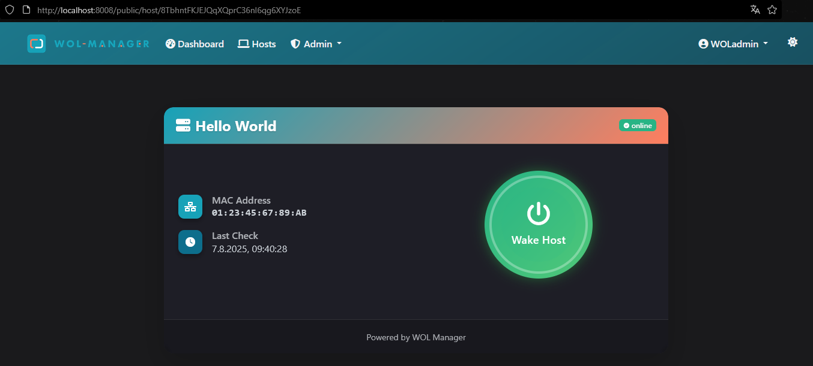

<div align="center">
  
  <p><strong>Wake‑on‑LAN Device Management, Simplified</strong></p>

  <!-- Badges (modern look) -->
  <a href="https://github.com/ReezFX/WOL-Manager/releases"></a>
  <a href="https://github.com/ReezFX/WOL-Manager/blob/main/LICENSE"></a>
  <a href="https://github.com/ReezFX/WOL-Manager/issues"></a>
  <a href="https://github.com/ReezFX/WOL-Manager/stargazers"></a>
  <a href="https://github.com/ReezFX/WOL-Manager/network/members"></a>

  <br>
  <sub>Flask • Wake-on-LAN • Docker • Dark/Light</sub>
</div>

---

> WOL-Manager is a Flask-based web application that provides a user-friendly interface for managing and waking devices using the Wake-on-LAN (WOL) protocol.

---

<div align="center">
  <a href="#-quick-start"><kbd>Quick Start</kbd></a> •
  <a href="#-features"><kbd>Features</kbd></a> •
  <a href="#-application-showcase"><kbd>Showcase</kbd></a> •
  <a href="#%EF%B8%8F-system-requirements"><kbd>Requirements</kbd></a> •
  <a href="#-security"><kbd>Security</kbd></a> •
  <a href="#-contributing"><kbd>Contribute</kbd></a>
</div>

## 🚀 Quick Start

```bash
# With Docker
docker-compose up

# Or manually
python3 -m venv venv && source venv/bin/activate
pip install -r requirements.txt
python manage.py run
```

> For full installation and usage, see the [Wiki](https://github.com/ReezFX/WOL-Manager/wiki)

<details>
<summary>📑 Table of Contents</summary>

- [Features](#-features)
- [Application Showcase](#-application-showcase)
- [System Requirements](#%EF%B8%8F-system-requirements)
- [Security](#-security)
- [Contributing](#-contributing)
</details>

---

## ✨ Features

- 🖥️ <strong>Host Management</strong>: Add, edit, view, and delete networked devices with MAC addresses
- 🌐 <strong>Wake‑on‑LAN</strong>: Send magic packets to wake devices remotely
- 🔐 <strong>User Authentication</strong>: Secure login system with session management (admin-managed user accounts)
- 🛡️ <strong>Role‑based Access Control</strong>: Different permission levels for users and administrators, with host visibility controls
- 🔗 <strong>Host Status API</strong>: External API endpoint for automated host status updates with token-based authentication
- 🌍 <strong>Public Host Access</strong>: Configurable public access controls for selected hosts with hash‑encrypted permalinks
- 📱 <strong>Responsive UI</strong>: Works on desktop and mobile devices
- 🌓 <strong>Dark/Light Mode</strong>: Toggle between dark and light themes
- 🐳 <strong>Docker Support</strong>: Easy deployment using containers

---

## 🎨 Application Showcase

<div align="center">
  <h3>Experience WOL-Manager in Action</h3>
  <p><kbd>MODERN</kbd> <kbd>RESPONSIVE</kbd> <kbd>INTUITIVE</kbd></p>
</div>

### 🌓 Theme Switching

<div align="center">
  <table border="0" cellspacing="0" cellpadding="10" style="border:none;">
    <tr>
      <td width="50%" align="center" style="border:none;">
        <h4>🌙 Dark Mode</h4>
        
        <br><br>
        <strong>Perfect for Night Owls</strong><br>
        <sub>Easy on the eyes • Reduced blue light • OLED-friendly</sub>
      </td>
      <td width="50%" align="center" style="border:none;">
        <h4>☀️ Light Mode</h4>
        
        <br><br>
        <strong>Crystal Clear Interface</strong><br>
        <sub>High contrast • Professional look • Daytime optimized</sub>
      </td>
    </tr>
  </table>
</div>

### 🔐 Advanced Features

<div align="center">
  
  <h4>🌐 Public Host Access</h4>
  <p><strong>Share Access Securely</strong></p>
</div>

<br>

---

## 🖥️ System Requirements

- Python 3.8 or higher (if installing manually)
- Docker and Docker Compose (if using containerized deployment)
- Network with support for broadcast UDP packets
- Devices configured to support Wake‑on‑LAN

---

## 🔒 Security

- Passwords are hashed using Werkzeug's security functions
- CSRF protection on all forms
- Rate limiting on wake attempts (10 per 5 minutes)
- Role-based access control to protected resources
- Input validation for all form fields
- Enhanced session and cookie security for external access deployments
- Automatic session expiration with configurable timeout periods
- Protection against session hijacking through secure session management
- Session validation on critical operations to ensure continued authentication
- Proper cleanup of expired sessions to prevent unauthorized access

---

## 🤝 Contributing

Contributions to WOL-Manager are welcome!

1. Fork the repository
2. Create a feature branch
3. Make your changes
4. Submit a pull request

Please adhere to the existing code style and add unit tests for any new functionality.

---

<div align="center">
  <sub>Made with ❤️ by <a href="https://github.com/ReezFX">ReezFX</a> and contributors</sub>
</div>
